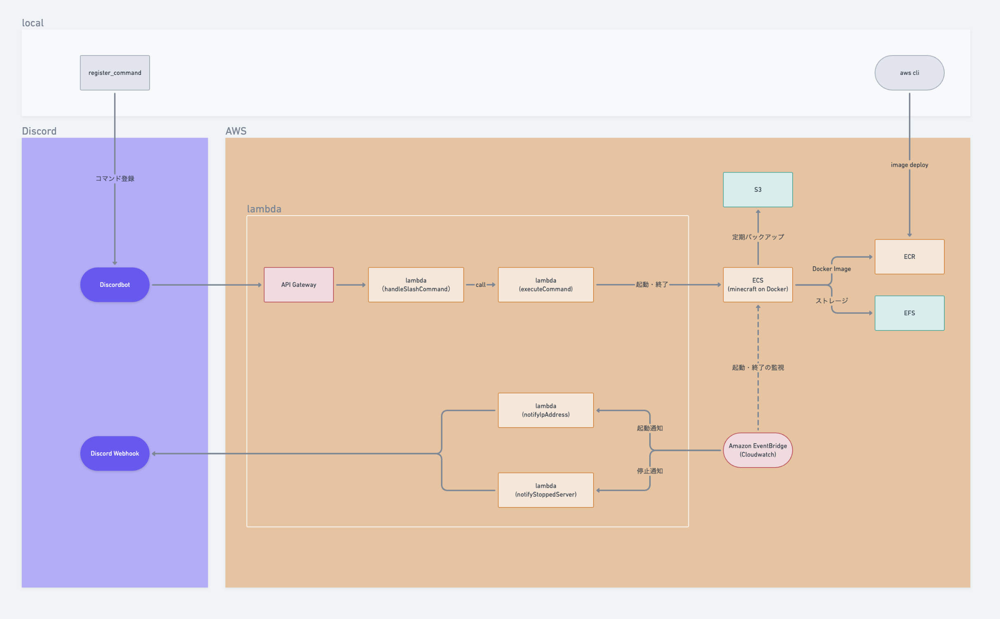

# minecraft
## ディレクトリ構造
```
/
├─ executeCommand           // ECS(マイクラサーバ)を起動させるlambda
├─ handleSlashCommandBot    // discordのコマンドを受け付けるlambda
├─ minecraft                // minecraft serverの設定・セーブデータ
├─ notifyIpAddress          // サーバ起動時にIPアドレスをdiscordに通知
├─ notifyStoppedServer      // サーバが終了したことをdiscordに通知
├─ register_command         // discord botにcommandを登録するスクリプト
└─ server                   // サーバ構成・バックアップ処理の定義（Dockerfile）
```

## アーキテクチャ



## memo
- ephemeral ipを使用しており、サーバ起動毎にIPアドレスが変わるためdiscordに通知している
- ecsは停止するごとにインスタンスが削除されるため、EFSでデータを永続化している（とても高い）
- 手元でビルドしたDockerイメージをECRへデプロイする。
- バックアップを復元したい場合、任意のバックをs3に配置しサーバを再起動すればOK
    - ただし、古いデータが残ってしまうので復元するたびに新しいEFSを作成・アタッチ(ECRの機動構成の修正も含む)する必要がある